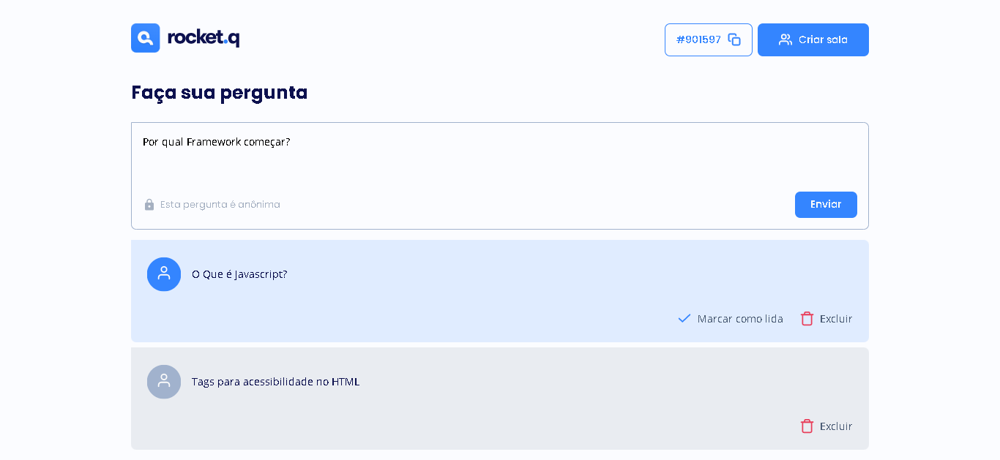
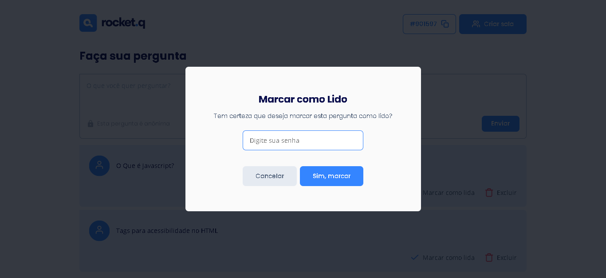
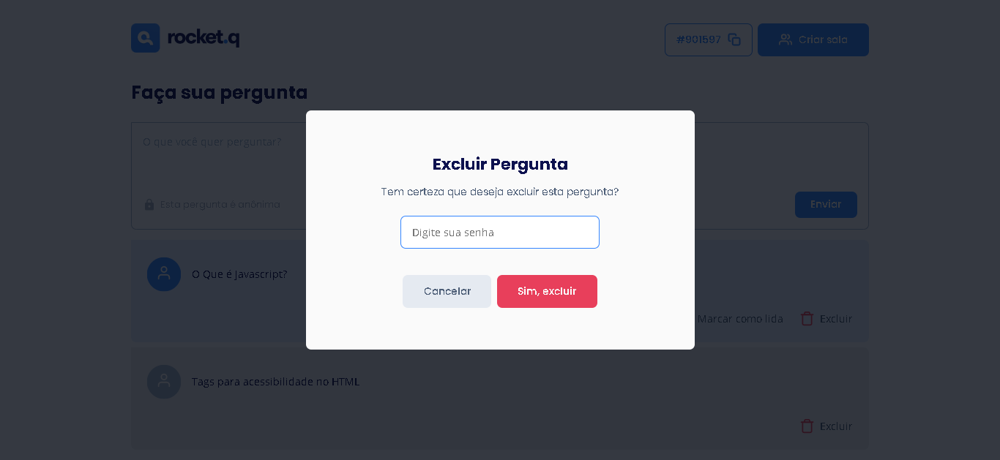

## RocketQ

Question room, options to delete and mark questions as read.

## Technology

Here are the technologies used in this project.

- NodeJS v16.14.0
- SQLite v4.0.25

## Services Used

- Github

## Getting started

- Dependency

  - Template Engine EJS ^3.1.6
  - Express for NodeJS ^4.17.3
  - sqlite3 ^5.0.2

## Run Project

- Start cloning the repository.

  `git clone https://github.com/brunorguerra/maratona-discover-rocketq`

- Then enter the folder. and install the dependencies.

  `npm install`

- To create and build your database accord of the project.

  `npm run init-db`

- To run the project.

  `npm start`

## How to use

### 1 - When logging in, you will see the home page. Being able to start by creating or entering a room

### 2 - This is the room creation page. choose a secure password and then it will generate your unique room.

### 3 - Here is your room. With options to delete and mark questions as read. Only those who have the password will be able to use the options

## Features

The main features of the application are:

- create private rooms.
- mark as read or delete messages with admin password.

## Links

- Repository: https://github.com/brunorguerra/maratona-discover-rocketq
  - In case of sensitive bugs like security vulnerabilities, please contact
    brunoguerracontact@gmail.com directly instead of using issue tracker. We value your effort
    to improve the security and privacy of this project!

## Versioning

1.0.0.0

## Authors

- **Bruno Bernardes Guerra**

Please follow github and join us!
Thanks to visiting me and good coding!
